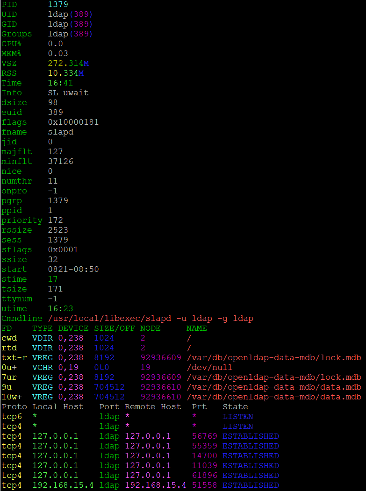

# About

Display all process table, open files, and network connections for a PID.




# Command Line Options
```
-d        Do not dedup.
-n        Do not resolve PTR addresses.
--nc      Disable color.
-p        Do not show pipes.
-r        Do not show show VREG / files.
-t        Do not show shared libraries.
-u        Do not show unix sockets.
```

# Enviromental Variables

The enviromental variables below may be set to set the default for the
flag in question.

Unless set to defined ands set to 1, these will default to 0.

| Variable |  Description  |
| -------- | ---------------- |
| NO_COLOR | If set to 1, color will be disabled. |
| PIDDLER_txt | If set to 1, libraries with the TXT type will not be shown. |
| PIDDLER_pipe | If set to 1, pipes will not be shown. |
| PIDDLER_unix | If set to 1, unix socket will not be shown. |
| PIDDLER_vregroot | If set to 1, VREG / will not be shown. |
| PIDDLER_dont_dedup | If set to 1, duplicate file handles are removed. |
| PIDDLER_dont_resolv | If set to 1, PTR addresses will not be resolved for network connections. |

# Installing

## FreeBSD

    pkg install perl5 p5-App-cpanminus
    cpanm Proc::ProcessTable::piddler
    
## Linux

### CentOS

    yum install cpanm
    cpanm Proc::ProcessTable::piddler

### Debian

This has been tested as working on Debian 9 minimal.

    apt install perl perl-base perl-modules make cpanminus gcc 
    cpanm Proc::ProcessTable::piddler
